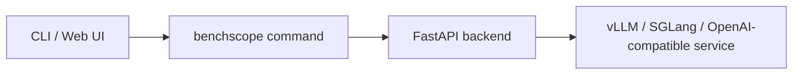

# Quick Start

BenchScope is an open-source LLM inference testing platform built on top of Harness Coding. It is a **visual testing platform for LLM performance and accuracy** that supports model inference based on **vLLM / SGLang**, as well as any **OpenAI-compatible** interface.

Instead of juggling raw `benchmark` scripts and scattered log files, BenchScope gives you a browser-based Dashboard, real-time performance dashboards, an accuracy evaluation suite, session chat, and persistent records — all from a single command.


## Overview

At a glance, BenchScope lets you:

- **Performance testing** — stress an inference service with two modes: *Concurrency Mode* (fixed concurrency levels) and *Threshold Mode* (automatic search for the maximum sustainable concurrency).
- **Accuracy testing** — evaluate model outputs against built-in datasets and scorers, in *Native* (local weights) or *Serving* (deployed service) mode.
- **Sessions** — an interactive, SSE-streaming chat-like workspace with Markdown rendering and sampling-parameter control.
- **Datas** — persistent records of every performance and accuracy run, with import / export and analysis.
- **Settings** — centralized configuration across 7 panels.



## Prerequisites

Before you begin, make sure you have:

- **Python 3.9+** installed on your machine (the package is pure Python).
- A **model inference service** you want to test. It can be:
  - a local **vLLM / SGLang** server (for example at `http://127.0.0.1:8000`), or
  - any **OpenAI-compatible** remote endpoint (provider Base URL + API key).
- (Optional) A GPU machine if you plan to run **Native accuracy** mode with local weights.

You do **not** need a GPU to run BenchScope itself — you only need one for the inference service you are testing.

## Installation

Install BenchScope from PyPI:

```bash
pip install benchscope
```

::: tip
We recommend installing into a dedicated virtual environment (for example with `python -m venv .venv && source .venv/bin/activate`) to keep dependencies isolated from other projects.
:::

If you plan to use **Native accuracy** evaluation that loads local model weights (transformers / HF id), install the optional extra as well:

```bash
pip install benchscope[accuracy-native]
```

## Start

Start the entire Web platform with a single command:

```bash
benchscope
```

After a few seconds the platform opens your default browser at `http://127.0.0.1:8080`. If the browser is not available (for example on a headless server), start it without auto-opening:

```bash
benchscope --port 8080 --no-browser
```

### Common options

| Option | Default | Description |
| --- | --- | --- |
| `--host` | `0.0.0.0` | Listening address (use `127.0.0.1` to restrict to local access) |
| `--port` | `8080` | Listening port |
| `--no-browser` | off | Do not automatically open the browser when starting |
| `--debug` | off | Enable debug logging |

You can also pass the same options through the explicit `serve` subcommand (see the [CLI Reference](cli.md) for details):

```bash
benchscope serve --host 127.0.0.1 --port 8080 --no-browser
```

## First Launch: the Dashboard

Open `http://127.0.0.1:8080` in your browser. You first land on the **Dashboard** overview, which gives you a summary of the whole platform.


From the Dashboard you can see:

- **Count panels** — quick numbers for Performance / Accuracy / Sessions / Skills / Models / Datasets / Providers.
- **Environment info** — network interfaces (MAC / IP / subnet / mask), framework version, hardware, and operating-system details.
- **Recent records** — latest performance and accuracy runs, with quick links into each page.

Use the top navigation bar to jump between **Dashboard · Performance · Accuracy · Sessions · Datas · Settings**.

## What Next?

Once the platform is running:

1. Go to **Settings → Providers** and configure the inference service endpoint (Base URL and API key).
2. Open **Performance** and create your first concurrency test — see the [Performance Testing](../core/performance.md) guide.
3. Try the step-by-step walkthroughs in [Concurrency Testing](../tutorials/perf-concurrency.md) and [Accuracy Evaluation](../tutorials/accuracy-guide.md).

::: tip
All task artifacts and configuration are stored under `~/.benchscope`. Learn how to move or back it up in [Configuration](configuration.md).
:::

## Related

- [Configuration](configuration.md) — data root directory, subdirectories, and built-in configs
- [CLI Reference](cli.md) — the `serve` / `perf` / `eval` subcommands
- [Performance Testing](../core/performance.md) — core feature overview
- [Accuracy Testing](../core/accuracy.md) — core feature overview
- [Update & Uninstall](update-uninstall.md) — upgrade and cleanup
