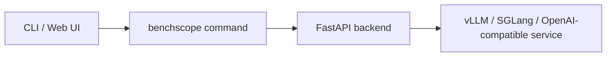

# Overview

BenchScope is an open-source LLM inference testing platform built on top of Harness Coding, providing **visual testing capabilities for LLM performance and accuracy**. It supports model inference provided by **vLLM / SGLang**, as well as all interfaces compatible with the **OpenAI protocol**.

No more hand-writing benchmark scripts in the terminal and manually tidying up scattered log files — a single command starts the complete Web platform, letting you finish concurrency stress tests, threshold probing, and accuracy evaluation in minutes.


<div class="tip">

**Tip**:

BenchScope itself does **not** require a local GPU or an inference framework. What is tested is the inference service you have already deployed (vLLM / SGLang, etc., default address `http://127.0.0.1:8000`); BenchScope sends the stress-test and evaluation requests, collects the data, and visualizes the results.

</div>

## What You Can Do

Once running, you can:

- **Performance testing** — stress the inference service in two modes: *Concurrency Mode* (a fixed concurrency level) and *Threshold Mode* (automatically searches for the maximum concurrency that can be sustained long-term).
- **Accuracy testing** — evaluate model outputs against built-in datasets and scorers, supporting *Native* (local weights) and *Serving* (deployed service) modes.
- **Sessions** — an SSE-streaming interactive chat workspace with Markdown rendering and sampling-parameter control.
- **Datas** — persistently saves every performance and accuracy run record, with import / export and analysis.
- **Settings** — centralized configuration covering multiple panels.



## Quick Install

Install BenchScope from PyPI (recommended in a dedicated virtual environment):

```bash
pip install benchscope
```

After installation, view the help (with no arguments, or when the first argument is an option, the CLI enters the serve-compatible branch and shows the service-startup options):

```console
$ benchscope --help
usage: benchscope [-h] [--host HOST] [--port PORT] [--no-browser] [--debug]

LLM inference performance testing tool. Supports vLLM, SGLang, and any
OpenAI-compatible API.

options:
  -h, --help    show this help message and exit
  --host HOST   listen address (default 0.0.0.0)
  --port PORT   listen port (default 8080)
  --no-browser  do not automatically open the browser
  --debug       enable debug logging
```

The three subcommands and their help:

| Subcommand | Purpose | View help |
| --- | --- | --- |
| `benchscope serve` | Start the Web service (unified frontend/backend entry point) | `benchscope serve --help` |
| `benchscope perf` | Run one stress test with the built-in engine (concurrency / threshold dual modes) | `benchscope perf --help` |
| `benchscope eval` | Run one accuracy evaluation (Serving / Native / Mock) | `benchscope eval --help` |

View the installed version:

```console
$ pip show benchscope
Name: benchscope
Version: 1.1.1
```

> The CLI does not provide a `--version` option; the version can also be viewed via `/api/version` in the Web interface, or on the Settings page.

## In This Section

- [Requirements](/en/docs/quickstart/requirements/) — the Python, service under test, network / browser, and optional GPU required to run
- [Starting the Platform](/en/docs/quickstart/platform/) — start the Web platform with one command, learn the common options and the Dashboard overview

For the detailed installation flow, see [Install](/en/docs/install/).

## Next Steps

After a successful start, you can:

1. Configure the inference service (Base URL and API Key) in **Settings → Providers**;
2. Go to the **Performance Testing** page and run your first concurrency stress test against the service — see [Performance Testing](/en/docs/performance/);
3. Follow the step-by-step tutorials to complete [Concurrency Testing](/en/docs/performance/concurrency/) and [Accuracy Evaluation](/en/docs/accuracy/guide/);
4. Go to the **Sessions** page and chat interactively with the model directly.

## FAQ

**Question: Does BenchScope need a GPU?**
No. BenchScope only sends requests and collects results; the GPU is used only by the inference service under test, or for native accuracy evaluation.

**Question: How do I update to the latest version / uninstall?**
See [Update & Uninstall](/en/docs/install/update-uninstall/).

**Question: Where can I view the data root directory and configuration?**
See [Configuration](/en/docs/install/configuration/).

## Related Docs

- [Install](/en/docs/install/) — environment requirements, configuration, update & uninstall
- [CLI](/en/docs/cli/) — overview of the `serve` / `perf` / `eval` subcommands
- [Performance Testing](/en/docs/performance/) — concurrency stress testing and threshold probing modes
- [Overview](/en/docs/accuracy/) — Native / Serving dual-mode evaluation