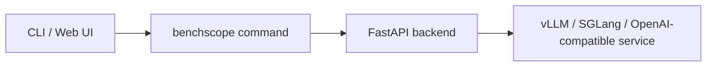

# Overview

BenchScope is an open-source LLM inference testing platform built on top of Harness Coding. It is a **visual testing platform for LLM performance and accuracy** that supports model inference based on **vLLM / SGLang**, as well as any **OpenAI-compatible** interface.

Instead of juggling raw `benchmark` scripts and scattered log files, BenchScope lets you start a complete Web platform with a single command and run concurrency stress tests, threshold probing, and accuracy evaluation in minutes.


<div class="tip">

**tip**：

BenchScope itself does **not** need a local GPU or an inference framework. What gets tested is the inference service you have already deployed (vLLM / SGLang, e.g. at `http://127.0.0.1:8000`); BenchScope sends the stress-test and evaluation requests, collects the data, and visualizes the results.

</div>

## What You Can Do

Once running, BenchScope lets you:

- **Performance testing** — stress an inference service in two modes: *Concurrency Mode* (fixed concurrency levels) and *Threshold Mode* (automatic search for the maximum sustainable concurrency).
- **Accuracy testing** — evaluate model outputs against built-in datasets and scorers, in *Native* (local weights) or *Serving* (deployed service) mode.
- **Sessions** — an interactive, SSE-streaming chat-like workspace with Markdown rendering and sampling-parameter control.
- **Datas** — persistent records of every performance and accuracy run, with import / export and analysis.
- **Settings** — centralized configuration across multiple panels.



## Quick Install

Install BenchScope from PyPI (preferably in a dedicated virtual environment):

```bash
pip install benchscope
```

After installation, verify the version and available commands:

```console
$ benchscope --version
benchscope 1.1.0
$ benchscope --help
usage: benchscope [-h] [--version] {serve,perf,eval} ...
```

## In This Section

- [Requirements](/en/docs/quickstart/requirements/) — Python, the inference service under test, network / browser, and optional GPU
- [Starting the Platform](/en/docs/quickstart/platform/) — launch the Web platform with one command and tour the Dashboard overview

For a more detailed installation flow, see [Install](/en/docs/install/).

## What Next?

Once the platform is running:

1. Go to **Settings → Providers** and configure the inference service endpoint (Base URL and API key).
2. Open **Performance** and create your first concurrency test — see the [Performance Testing](/en/docs/performance/) guide.
3. Try the step-by-step walkthroughs in [Concurrency Testing](/en/docs/performance/concurrency/) and [Accuracy Evaluation](/en/docs/accuracy/guide/).
4. Open **Sessions** to interact with the model directly in a chat-like workspace.

## FAQ

**Q: Does BenchScope require a GPU?**
No. BenchScope only sends requests and collects results; a GPU is needed only by the inference service under test, or for Native accuracy evaluation.

**Q: How do I update to the latest version / uninstall?**
See [Update & Uninstall](/en/docs/install/update-uninstall/).

**Q: Where can I learn about the data root and configuration?**
See [Configuration](/en/docs/install/configuration/).

## Related Docs

- [Install](/en/docs/install/) — requirements, configuration, update & uninstall
- [CLI](/en/docs/cli/) — overview of the `serve` / `perf` / `eval` subcommands
- [Performance Testing](/en/docs/performance/) — concurrency and threshold modes
- [Accuracy Testing](/en/docs/accuracy/) — Native / Serving dual-mode evaluation
