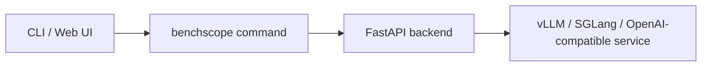

# 概述

BenchScope 是一个开源的大模型（LLM）推理测试平台，基于 Harness Coding 构建，为 LLM 的**性能与精度**提供可视化测试能力。它支持基于 **vLLM / SGLang** 的模型推理，以及所有兼容 **OpenAI 协议**的接口。

无需在命令行手写 benchmark 脚本、再手动整理零散的日志文件——只需一条命令即可启动完整的 Web 平台，在几分钟内完成并发压测、阈值探测与精度评测。


<div class="tip">

**tip**：

BenchScope 本身**不需要本地 GPU 或推理框架**。被测试的是你已部署的推理服务（vLLM / SGLang 等，默认地址 `http://127.0.0.1:8000`），BenchScope 负责发起压测与评测请求、收集数据并可视化结果。

</div>

## 能做什么

启动后，你可以：

- **性能测试** — 以两种模式对推理服务压测：*并发模式*（固定的并发数）与 *阈值模式*（自动搜索可长期维持的最大并发数）。
- **精度测试** — 基于内置数据集与评分器评测模型输出，支持 *原生（Native）*（本地权重）与 *服务（Serving）*（已部署服务）两种模式。
- **Sessions** — SSE 流式交互式对话工作区，支持 Markdown 渲染与采样参数控制。
- **Datas** — 持久化保存每次性能与精度运行记录，支持导入 / 导出与分析。
- **Settings** — 集中式配置，覆盖多个面板。



## 快速安装

从 PyPI 安装 BenchScope（推荐在独立虚拟环境中进行）：

```bash
pip install benchscope
```

安装完成后验证版本与可用命令：

```console
$ benchscope --version
benchscope 1.1.0
$ benchscope --help
usage: benchscope [-h] [--version] {serve,perf,eval} ...
```

## 本分区内容

- [环境要求](/zh/docs/quickstart/requirements/) — 运行所必需的 Python、被测试服务、网络 / 浏览器与可选 GPU
- [启动平台](/zh/docs/quickstart/platform/) — 一条命令启动 Web 平台，了解常用选项与 Dashboard 总览

更详细的安装流程见 [安装](/zh/docs/install/)。

## 下一步

启动成功后，你可以：

1. 在 **Settings → Providers** 配置推理服务（Base URL 与 API Key）；
2. 进入 **性能测试** 页对服务做首次并发压测 —— 见 [性能测试](/zh/docs/performance/)；
3. 参考分步教程完成 [并发测试](/zh/docs/performance/concurrency/) 与 [精度评测](/zh/docs/accuracy/guide/)；
4. 进入 **Sessions** 页直接与模型进行交互式对话。

## 常见问题

**问题：BenchScope 需要 GPU 吗？**
不需要。BenchScope 只发起请求并收集结果；GPU 仅由被测试的推理服务使用，或用于原生精度评测。

**问题：如何更新到最新版本 / 卸载？**
见 [更新与卸载](/zh/docs/install/update-uninstall/)。

**问题：在哪里查看数据根目录与配置？**
见 [配置说明](/zh/docs/install/configuration/)。

## 相关文档

- [安装](/zh/docs/install/) — 环境要求、配置、更新与卸载
- [CLI](/zh/docs/cli/) — `serve` / `perf` / `eval` 三个子命令总览
- [性能测试](/zh/docs/performance/) — 并发压测与阈值探测双模式
- [概述](/zh/docs/accuracy/) — 原生 / 服务双模式评测
